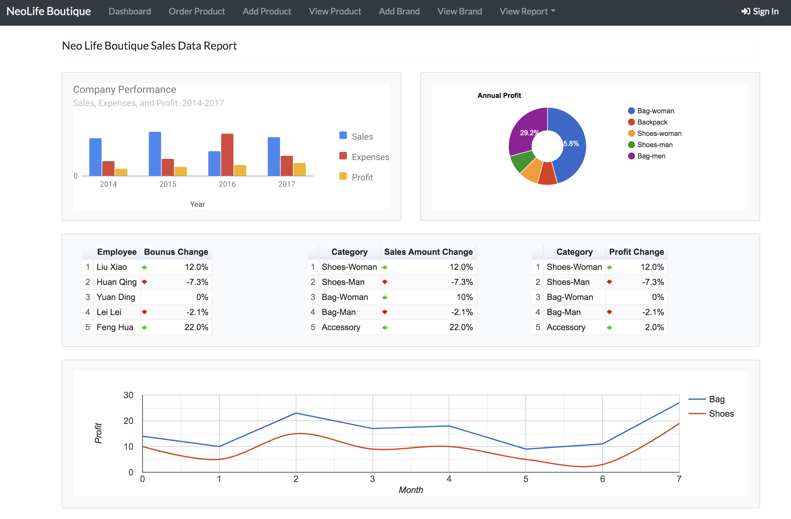
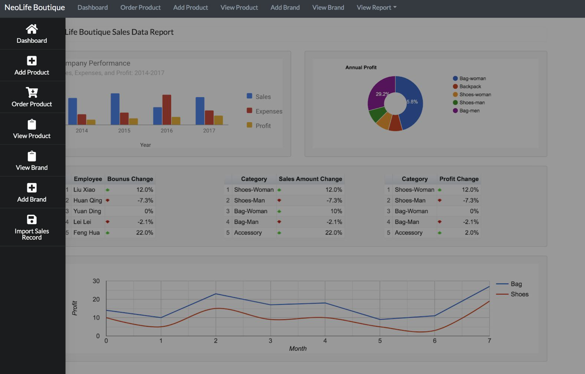
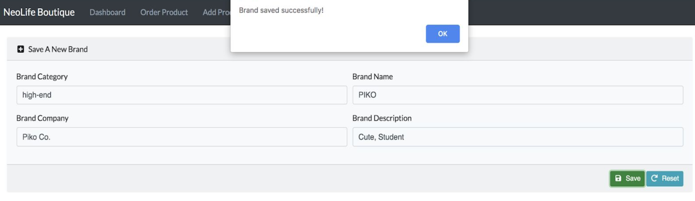
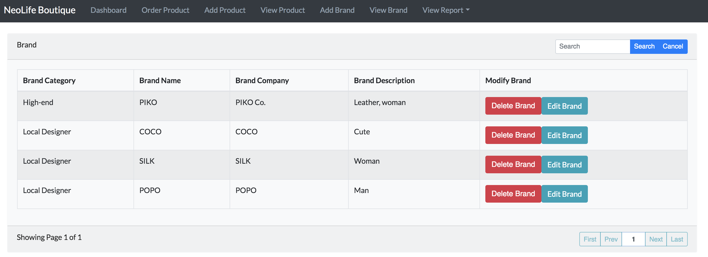

# Introduction

This project is to help my uncle manage the inventory data of his leather boutique store, and help me practice what I have learned at school/during my Co-op. 

The features include product save/update/delete/search.

Primary data analysis features include monthly/seasonal sales data viewing.

Store employees have to sign in to edit the data.

Greatly appreciate my uncle to provide the chance to work on this real-based project

# Front-end Part (Working)

The front end is implemented with React, React Bootstrap, Sematic UI React

#### Dashboard

#### Sidebar

#### Add/Edit Feature

#### View/Delete Feature

#### nav-bar.js

Using recursive rendering, if you want to change the content, just change the ./component/_nav.js file

By clicking the nav brand, viewSideBar() will be called, and this will change side bar visibility.

#### side-bar.js

Side bar visibility can be changed by calling viewSideBar() in App.js. Side bar items are imported through ./component/_sidebar.js file

# Back-end Part (Working)

The front end is implemented with Springboot, JPA, Hibernate, Spring Security, Lombok

# Database Part(Completed)

### DBMS MySQL
[Sql file to build the database and insert testing data](Store_data.sql)

### ERD

### Stored Procedure & View
[Sql file to create the view and stored procedure](Stored_procedure&View.sql)

#### Stored Procedure

1. Given a month, check the monthly sales record for each salesperson and calculate the bonus for each salesperson

User(s): Store Manager, Salesperson who is in charge of calculating bonus

Purpose: Calculate the bonus for salespeople 

2. Given a product name keyword (e.g. Bag), list all the products from the product list 

User(s): Store Manager, Store Employees		

Purpose: Allows store employees to search the available products by the product name

3. Given a range of shoe sizes, list all the shoes that match the criteria 	

User(s): Store Manager, Store Employees		

Purpose: Allows store employees to bring up a list of all the shoes that are carried by the store

4. Calculate the difference between the purchase price and selling price of each product from the product list and arrange by profit

User(s): Store Manager	

Purpose: Provides the store manager with insight regarding the amount of profit that is being generated by each product

5. Given a product ID, list all the available monthly sales records

User(s): Store Manager	

Purpose: Help the store manager to analyze the popularity of a product during the time

6. Given the EMP_NUM,CUSTOMER_ID_DEAL_ID create a new sales order, since one sales order can contain multiple products, so we first input the basic info, then use another procedure to insert the product info

User(s): Store Manager,employees

Purpose: Helps the store manager and store employees to create a new sales order

7. Given the PRODUCT_ID,PRODUCT_AMOUNT,ORDER_TYPE,EMP_NUM, add the product into newly created order, this procedure can be used after creating a new sales order( by calling procedure AddSalesOrder), can also be used after creating a new purchase order or outbound order

User(s): Store Manager,employees

Purpose: Help the store manager and employees to insert product information into sales/purchase/outbound order

#### View

1. For each product ID, list how many product are in the store inventory and warehouse inventory

User(s): Store Manager, warehouse employee, salespeople

Purpose: Provides the  inventory information of all the product

2. For each outbound order ID, show the location of each product in the warehouse, and the location in the store 

User(s): Store Manager, warehouse employee, salespeople

Purpose: Provides accurate outbound order information including the product name, the required amount,stored location, issue date, issue person, so warehouse manager can find the product quickly, and then send to the store

# Testing

#### front-end

Selenium WebDriver

#### back-end

Junit
